# TutorialFlask
Este es el seguimiento del tutorial de flask 
# Parte A
## Creación del entorno virtual.

---

Lo que tenemos que hacer ahora es comprobar si tenemos venv  

### 1.Si esta instalada esto es lo que hay que hacer

1.1 Ejecutamos powershell y nos movemos a donde queramos crear la carpeta.
1.2 Creamos una carpeta con `mkdir nombre_carpeta`.
1.3 Entramos dentro de ella: `cd nombre_carpeta`.
1.4 Ejecutamos el comando `py -3 -m venv env`.
1.5 Ahora ejecutamos el comando  `env\Scripts\activate` que es para activar el entorno que emos creado.

Una vez hecho esto nos vamos a visual studio y creamos en la carpeta del venv un `.py` que se llamara app donde escribiremos lo siguiente:

 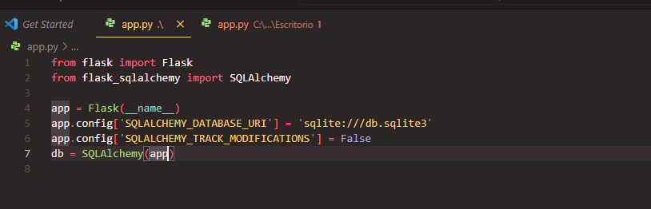
------

## Creamos nuestras tablas (Models).

Para hacer eso debemos tener en cuenta lo siguiente:

1. Al establecer las columnas de nuestras tablas tenemos que asignar el tipo de datos de cada una de ellas.
2. Debemos esatablecer como primary_key la columna id en las 3 tablas.
3. En caso de la tabla Order, la columna order_date recibirá por defecto la hora en ese momento.
4. Si queremos que nuestra columna no pueda recivir valores nulos usaremos  `nullable` con valor `False`.
5. Si queremos que nuestra columna no pueda recivir repetidos nulos usaremos `unique` con valor `True`.

## Establecemos la relación entre nuestras tablas.

## Hora de comprobar el funcionamiento de nuestra base:

### 2.Estos son los pasos a seguir:

2.1. Entramos a la consola Flask usando `flask shell`.
2.2. Luego escribimos el comando `from app import db` donde app es el documento donde tenemos la base y db es la base.
2.3. Usamos el comando `db.create_all()` para generar la base.

## Hacemos la comprobacion de la base.

### 3.Para comprabar nuesta base debemos hacer lo siguiente:

1. Comprobamos que sqlite3 este instalada.
2. Ejecutamos el comando `sqlite3 nombre_archivo_db`.
3. Verificamos las tablas creadas con el comando `.tables`.
4. Verificamos el esquema de cada una de nuestras tablas con el comando `.schema`.

## Agregar información a nuestra base de datos.

### 4. Para agregar informacion a nuestra tabla debemos hacer lo siguiente

1. Entramos a flask con el comando `flask shell`.
2. Importamos de nuestra app flask con los atributos  db, Product, Order, Customer.
3. Creamos una variable la cual llamaremos como pepepa donde luego indicaremos `nombre_tabla(nombre_col, nombre_col)`.
4. Añadimos a nuestra base de datos al cliente haciendo uso del comando `db.session.add(nombre_variable)`.
5. Por último hacemos un commit `db.session.commit()`.

## Hacemos la comprobacion de la base.

### 5.Para comprabar nuesta base debemos hacer lo siguiente:

5.1. Ejecutamos el comando `sqlite3 nombre_del_archivo_db`.
5.2. Realizamos una query `select * from customer;`.
5.3. Observamos que nuestro usuario ha sido agregado correctamente.

### 6.1Añadimos más datos a nuestra base de datos.

### 6.2Comprobamos que han sido agregados de forma correcta.

## Actualizar nuestra base de datos.

### 7.Para actualizar informacion de nuestra tabla debemos hacer lo siguiente

1. Entramos a flask con el comando `flask shell`.
2. Importamos de nuestra app flask con los atributos  db, Product, Order, Customer.
3. Realizamos una query utilizando un filtro `filter_by()` para coger el atributo que queremos cambiar y luego usamos `first()`para solo tener 1.
4. Comprobamos que es el registro que deseamos actualizar.
5. En este caso deseo actualizar la dirección `pepepa.address = "456"`.
6. Una vez actualizado el valor, guardamos los cambios `db.session.commit()`.

## Borrar datos de nuestra base 

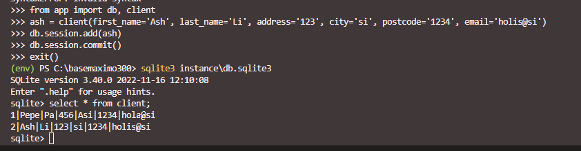

### 8.Para borrar informacion de nuestra tabla debemos hacer lo siguiente

1. Creamos un nuevo registro, para luego eliminarlo.
2. Comprobamos que ha sido agregado correctamente.
3. Hacemos una query para poder encontrar el registro que deseamos y lo asignamos una variable.
4. Comprobamos que es el registro que deseamos eliminar.
5. Eliminamos el registro haciendo uso del comando `db.session.delete(nombre_variable)`.
6. Guardamos los cambios con `db.session.commit()`.
7. Comprobamos que ha sido eliminado correctamente.

## Generar información para nuestra base de datos.
Para ello usaremos Faker 

### 9.Para crear informacion de nuestra tabla debemos hacer lo siguiente

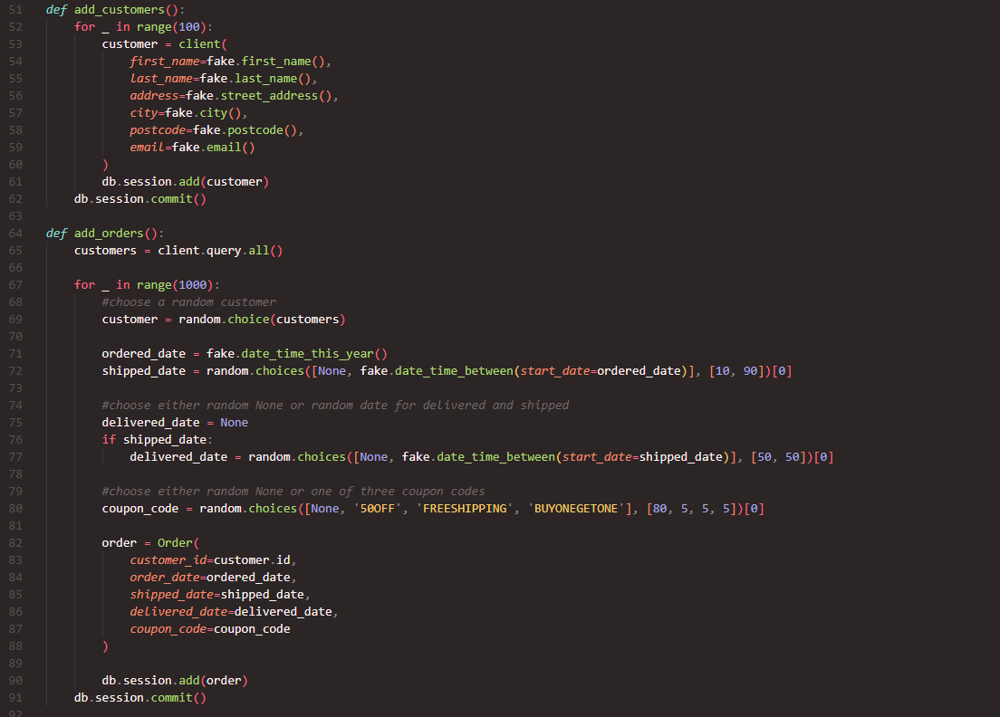
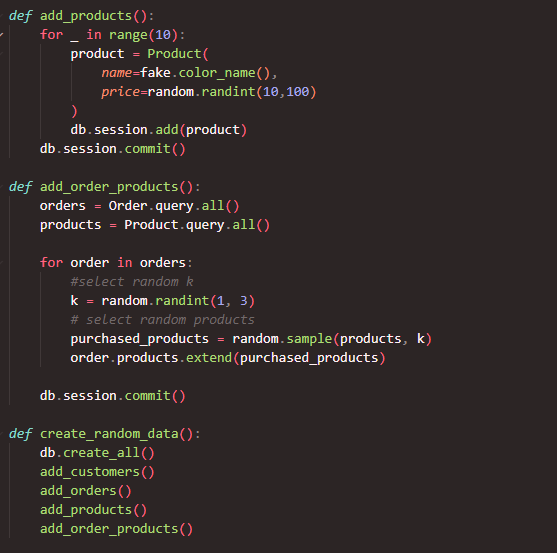

### Abrimos nuestra consola Flask e importamos el método para generar información.

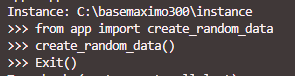
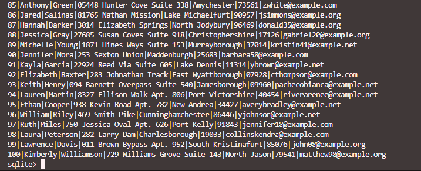

Como podemos ver se crean las instancias que le pedimos a las variables que creamos

# Parte B
### Pedidos realizados por un cliente.

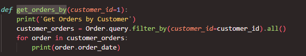

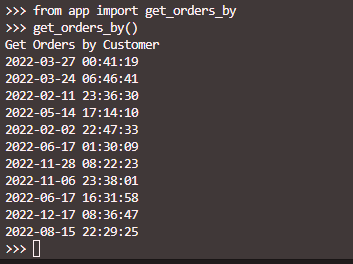

### Cuantos clientes hay?

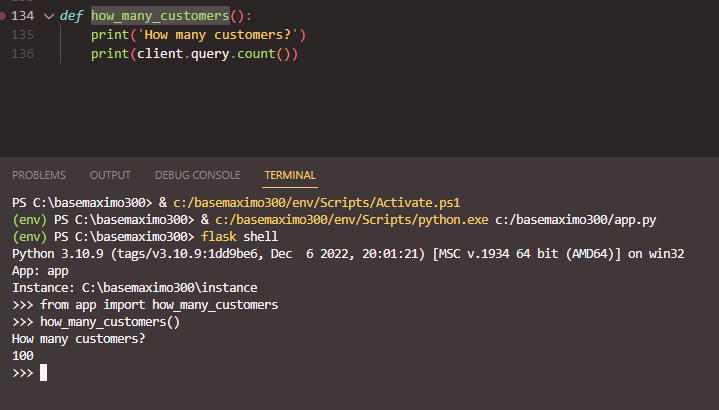

### Usos de los cupones que nos sean "FRFEESHIPING"

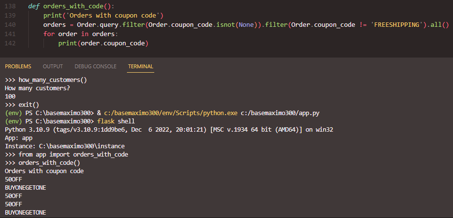

### Queremos los ingresos en los x días anteriores, por defecto definimos 30.

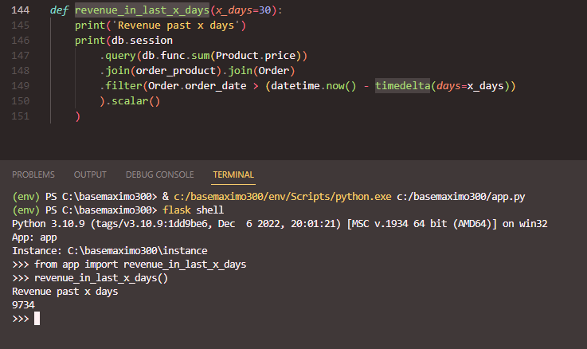

### Tiempo que tarda la entrega

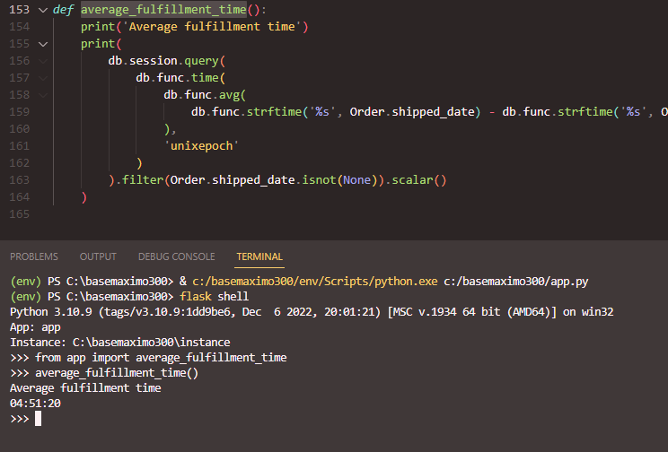

### Por último queremos saber cuantos clientes han gastado una cantidad superior a x cantidad de dollars.

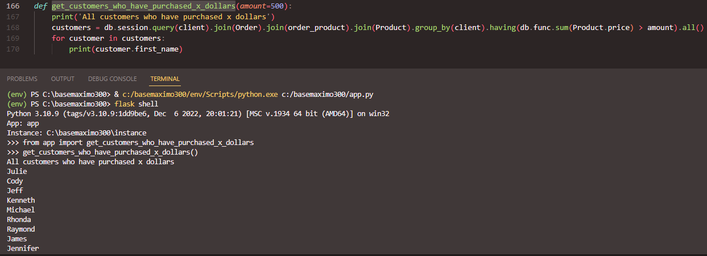

# Fin

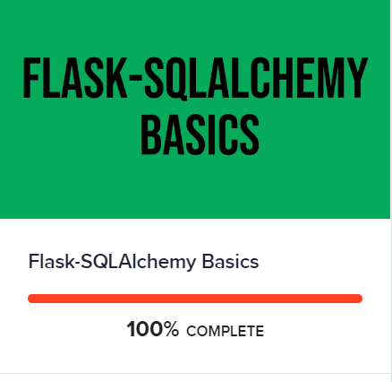
